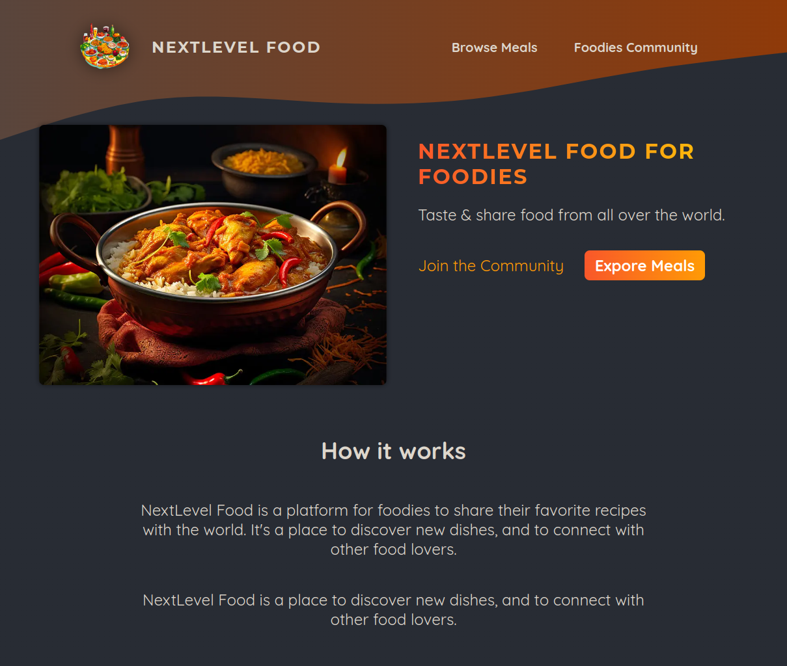
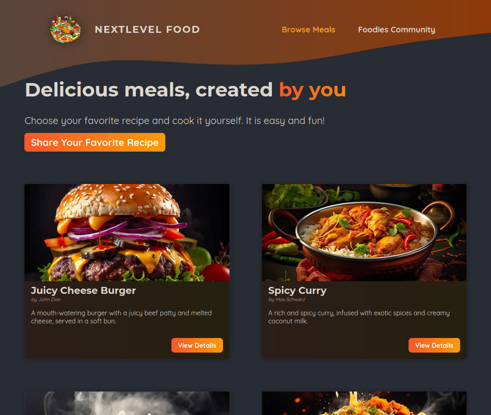
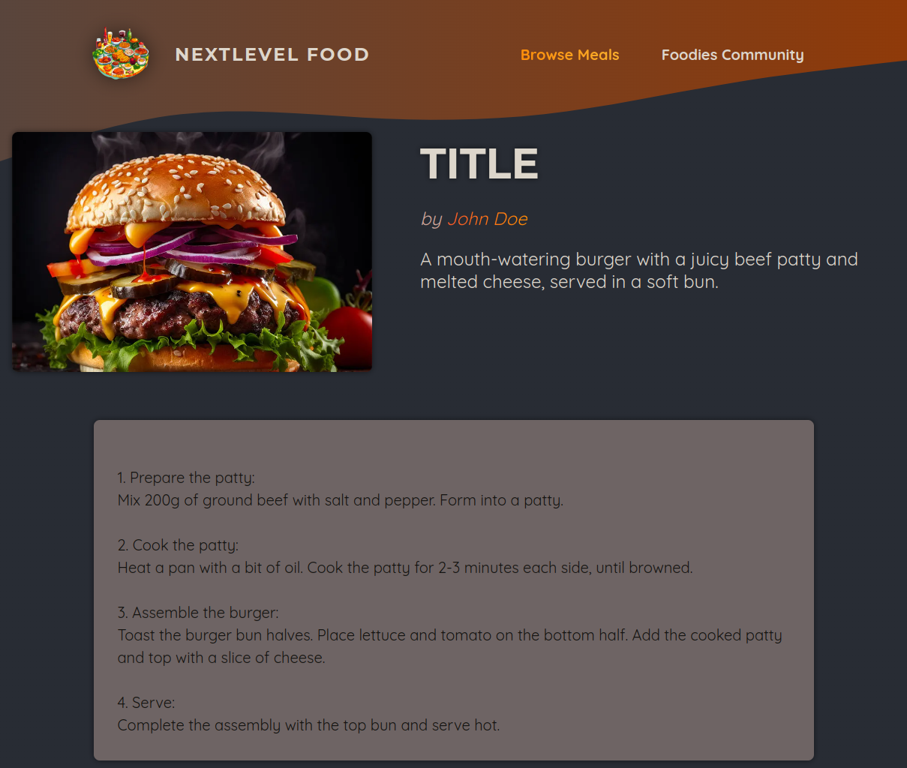
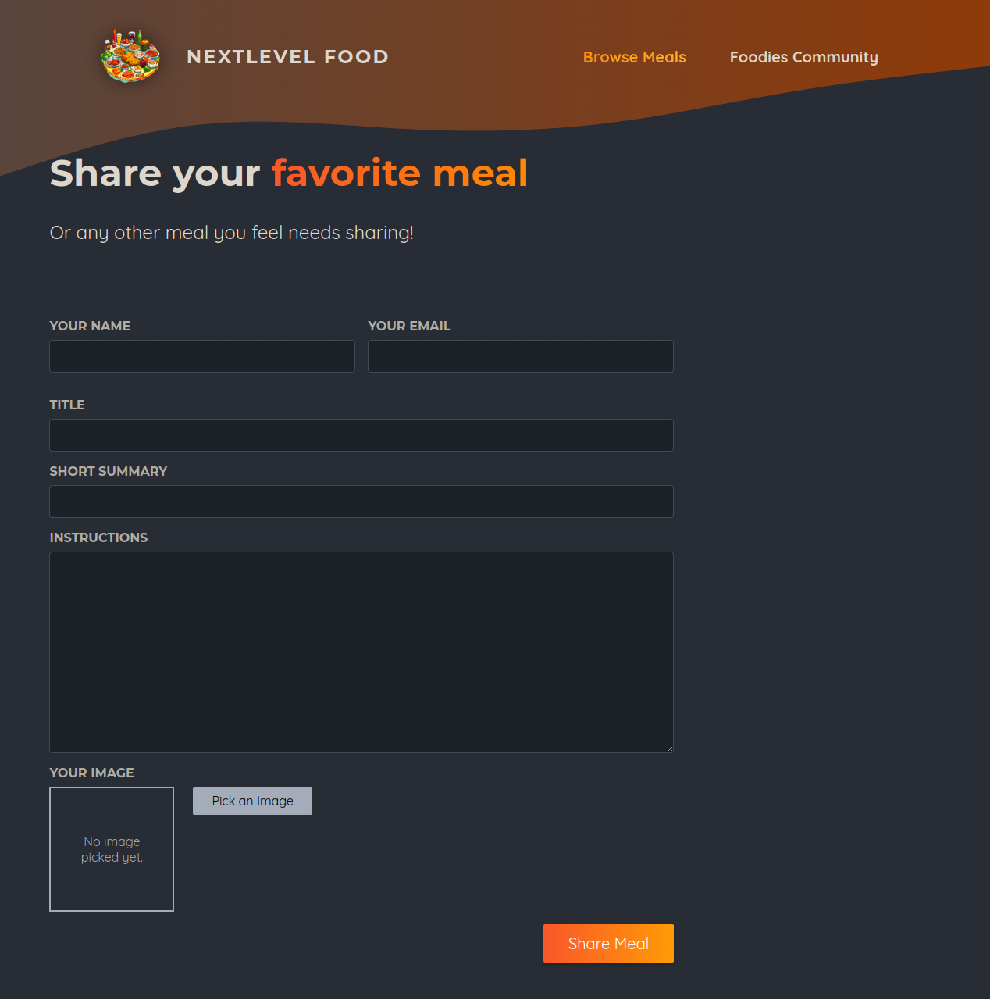

# NextLevel Meals

This is an example project I have written using Nextjs framework. NextLevel Meals allows you to share your favorite meal or recipe. Includes server and web components.

## Stack

Nextjs 14, App Routing, Javascript (not typescript), CSS Modules, SQLite3, better-sqlite3, slugify, xss

## Usage

1. Clone the repository:

```bash
git clone git@github.com:garygause/next-meals-app.git
```

or

```bash
git clone https://github.com/garygause/next-meals-app.git
```

2. Install dependencies:

```bash
npm install
```

3. Run the server:

```bash
npm run dev
```

## Screenshots

Home Page  
:-------------------------:
 |

Explore Page  
:-------------------------:
 |

Details Page  
:-------------------------:
 |

Share Page  
:-------------------------:
 |

## Credits

Based on the [Next.js 14 & React - The Complete Guide](https://www.udemy.com/course/nextjs-react-the-complete-guide) course by Maximilian Schwarzmüller.
